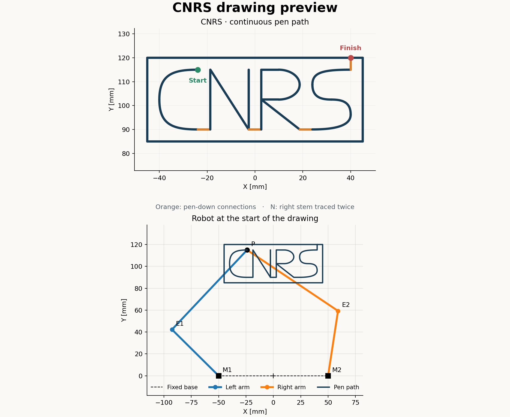

# CNRS pen drawing



The pen draws capital CNRS with horizontal connections between the letters.
After the S, it moves straight up and traces a closed rectangle clockwise.
The pen stays down throughout; the N's right stem is retraced.

Default dimensions:

- Robot: `l1 = 60 mm`, `l2 = 100 mm`, `d = 100 mm`.
- Letters: 80 × 25 mm, centered at X = 0, baseline Y = 90 mm.
- Frame: 5 mm margin, giving a 90 × 35 mm rectangle.
- The frame begins and ends at (40, 120) mm, directly above the S endpoint.

## Generate the path

Run these commands from the repository root.

```bash
python3 -m pip install -r kinematics/requirements.txt
python3 -m drawing.cnrs
```

This regenerates the [PNG preview](output/cnrs_preview.png),
[SVG preview](output/cnrs_preview.svg), [motor CSV](output/cnrs_trajectory.csv),
[metadata](output/cnrs_trajectory.json), and
[motor profiles](output/cnrs_motor_profiles.png).

Arguments use meters, seconds, and Hz:

```bash
python3 -m drawing.cnrs --border-margin .005 --speed .01 --rate 100
python3 -m drawing.cnrs --preview-only
```

Use `--border-margin 0` to omit the frame. Other geometry options are
`--l1`, `--l2`, `--d`, `--width`, `--height`, `--baseline`, and `--center-x`.
Width and height describe the letters; the margin expands their bounding box.

The path uses lines and cubic Bezier curves. Quintic timing gives zero velocity
and acceleration at each stroke boundary, including rectangle corners.
The default CSV caps pen speed at 10 mm/s and samples at 100 Hz.
The framed path contains 10,665 samples and lasts 106.64 seconds at 1×.

## Play on the robot

The controller uses the [Pico dual-PMSM control library](https://github.com/thomasfla/pico_dual_PMSM_BU79100G_DRV8316C).
It defaults to `motor_usb` from the neighboring
`pico_dual_PMSM_BUG79100G_DRV8316C/software/motor_usb` directory.
Install `pyserial` if needed. For another checkout, set `PYTHONPATH` to its
`software` directory as described in the [root README](../README.md), or pass
`--motor-usb-path /path/to/software/motor_usb`.

With the pen raised:

```bash
python3 -m drawing.draw_robot
```

It moves to the first pose, waits for you to lower the pen and press Enter,
draws the path, then holds the final pose until you lift the pen and press
Enter again. Both terminal waits use an acknowledged `timeout_ms=0` hold.
Motion uses a 20 ms watchdog; leaving the controller context disables the motors.

Playback defaults to **2×**, taking **53.32 seconds** for the drawing.
The multiplier scales drawing time and motor velocities together.

```bash
python3 -m drawing.draw_robot --speed-multiplier 3
python3 -m drawing.draw_robot --speed-multiplier 1
python3 -m drawing.draw_robot --dry-run
```

Current defaults are `kp=12`, `kd=0.3`, a 2-second approach, and a 500 Hz
command rate. Adjust them with `--kp`, `--kd`, `--approach-seconds`, and
`--control-rate`. The approach and settling use their own timing.

The settling check requires position error within 0.03 rad and RMS speed
within 0.1 rad/s over a rolling 0.25-second window. Options:
`--position-tolerance`, `--speed-tolerance`, `--settle-window`, and
`--settle-timeout`. Connection options are `--port` and `--motor-usb-path`.

## Coordinate and CSV conventions

The numerical solver, CSV, and calibrated encoders all use radians,
**clockwise-positive from north**. CSV angles go directly to `m0` (left)
and `m1` (right). The current measured pose is only used to begin the approach.

| Columns | Units / meaning |
| --- | --- |
| `time_s` | Seconds from drawing start |
| `q1_rad`, `q2_rad` | Motor angles, radians |
| `dq1_rad_s`, `dq2_rad_s` | Motor velocities, rad/s |
| `x_m`, `y_m` | Tip position, meters |
| `vx_m_s`, `vy_m_s` | Tip velocity, m/s |
| `stroke_index` | Index into the metadata's stroke list |

The first pose uses the highest tip and widest elbows. The generator maintains
that elbow mode along the whole path and rejects unreachable or singular poses.

```bash
python3 -m unittest discover -s kinematics -v
python3 -m unittest discover -s drawing -v
```

Controller tests use simulated motors and do not open USB.
